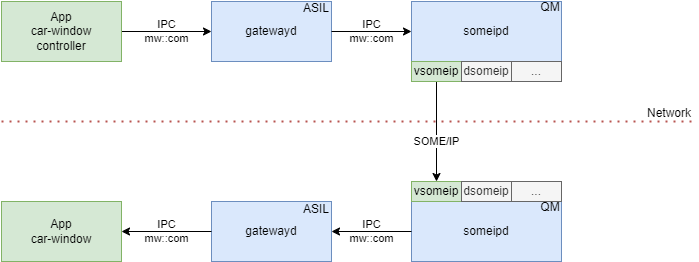

# SOME/IP Gateway

The gateway is divided into a gateway daemon (gatewayd) which contains the network-independent logic (payload serialization, etc.) and the SOME/IP daemon (someipd) which binds to the concrete SOME/IP stack.
The IPC interface between the gatewayd and the someipd serves as isolation boundary between ASIL and QM context and also allows to replace the network stack without touching the main gateway logic.




---

## 🚀 Getting Started

### Clone the Repository

```sh
git clone https://github.com/eclipse-score/inc_someip_gateway.git
cd inc_someip_gateway
```

### Start the daemons

Start the daemons in this order:

```sh
bazel run //src/gatewayd
```

and in a separate terminal

```sh
bazel run //src/someipd
```

### Run Example app

```sh
bazel run //examples/car_window_sim:car_window_controller
```

If you type `open` or `close` the command will be sent via network.


### Dockerized integration test POC

For integration tests, a docker based approach was taken.
As a proof of concept `docker compose` can be used to build, setup and run the containers.
In the future a pytest based setup can be implemented to orchestrate the containers.

Build the docker containers:

```sh
docker compose --project-directory tests/integration/docker_setup/ build
```

Start up the containers:

```sh
docker compose --project-directory tests/integration/docker_setup/ up
```

Those containers are pre-configured (IP adresses, multicast route, ...).
The someipd-1 container already starts up the `gatewayd` and the `someipd`.

In Wireshark the network traffic can be seen by capturing on `any` with `ip.addr== 192.168.87.2 || ip.addr ==192.168.87.3`.

On the client side, start up the `sample_client` in another shell:

```sh
docker exec -it --env VSOMEIP_CONFIGURATION=/home/source/tests/integration/sample_client/vsomeip.json docker_setup-client-1 /home/source/bazel-bin/tests/integration/sample_client/sample_client
```

Finally start the benchmark on the someipd-1 container in a third shell:

```sh
docker exec -it docker_setup-someipd-1 /home/source/bazel-bin/tests/performance_benchmarks/ipc_benchmarks
```
