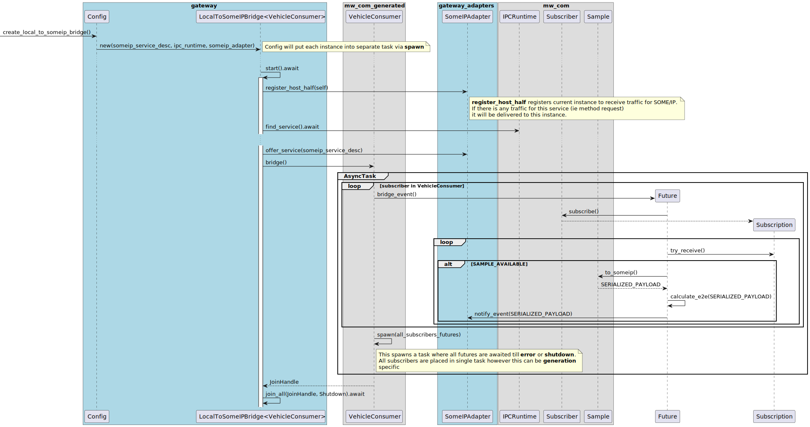
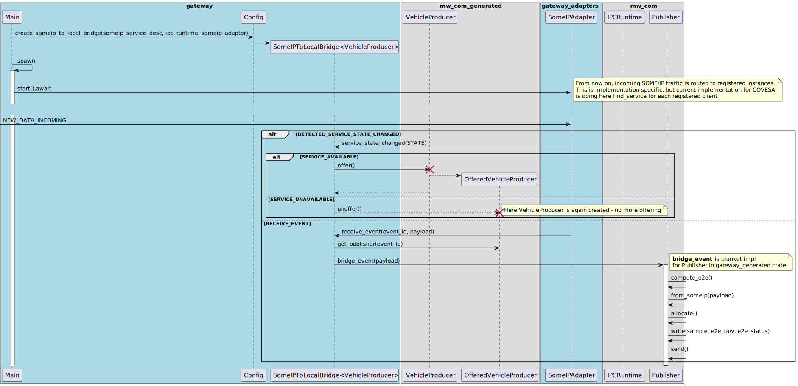

# Qorix SOME/IP Gateway PoC

**Feature Coverage Overview**

---

## Feature Request Coverage by PoC

- ✅ **Coded in Rust**
- ✅ **Based on S-CORE IPC `mw_com`** Rust frontend
  - Handling of **SOME/IP Events** only (as `mw_com` currently supports *pub-sub* pattern)
- ✅ **E2E handling**
  - Both at gateway and application side
- ✅ **Abstraction of SOME/IP Stack**
- ⚠️ **ACL**
  - Requires **CFT discussions**

> PoC implementation uses **COVESA VSOMEIP** stack

---

## Architecture Overview

---

## Key Design Highlights

- **Stack Abstraction via Adapter Interface**
  - Core logic is **stack-agnostic**
  - Projects can integrate **any SOME/IP stack** by implementing a new adapter

- **Async Rust Infrastructure**
  - Lightweight task-based concurrency model
  - Thread management, priorities, and scheduling are **fully configurable** outside of gateway logic
  - Improves **integration flexibility** and **runtime scalability**

- **Strict E2E Enforcement**
  - Mandatory checks for all applications
  - Optimized path for **locally produced & consumed** data

---

## Bridging: Local → SOME/IP

---

## Bridging: SOME/IP → Local

---

## E2E Handling Logic

### Incoming SOME/IP Data
1. Extract **E2E value** from SOME/IP payload  
2. Compute **CRC check**
3. Validate **sequence counter**

➡️ Gateway deserializes SOME/IP → ABI-compatible types and forwards:
- `data`
- `raw_e2e_value`
- `gateway_check`

Application layer must:
- Recheck E2E integrity before data access  
- Handle both **gateway-level** and **local-level** E2E errors

---

## E2E Handling Logic (continued)

### Outgoing SOME/IP Data
- E2E is **computed in gateway** (subject to discussion)
- E2E is **serialized together with data**  
- Final payload sent via SOME/IP stack

---

## Live Example
A working **live demonstration** is included in the repository. Run it using `scripts/run_mvp.sh`

---

# Thank You 🙌

**Qorix SOME/IP Gateway PoC** at https://github.com/qorix-group/someip_gateway
